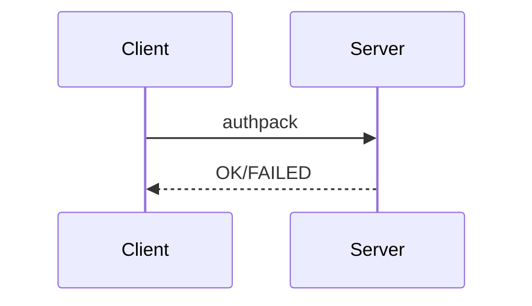
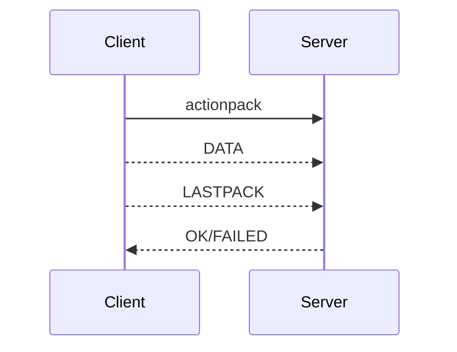

# 介绍

ddcw-ei 最开始定位是安装软件的, 直接上传安装脚本和软件包然后远程安装的.(v0.x).

后来改为了监控mysql和一些常用的数据库工具集成(v1.x), 但是不想写了(最开始没有设计好,中间老是变来变去...)

主要有4个进程

服务端: 1. server 提供主要功能,监控数据存储,数据库工具以task方式运行   2.web提供web界面和api

客户端: 1. mysql_agent最开始是计划的监控和执行一些常用的mysql/linux命令的, 后来忘记了,就只有监控mysql的功能了.  2.transclient传输监控数据到server的.(可使用rsync之类的替代)

注:mysql的监控数据实际上只存储了部分global status. (1KB). 没得索引, 每天一个文件(24\*3600\*1KB). 每个时间的数据就是 当前的秒数乘1024.   OFFSET = (hour\*3600+minute\*60+second)*1024  然后read(1024)


不推荐使用. 如果你有啥好的建议,需求,或者问题之类的直接提issue, 明年才会重构(设计很重要....)

(没想到吧,居然更新了 +_+)


# 使用

服务端:

```python
python main.py start server
python main.py start web
```

客户端:

```python
cd mysql_agent
python mysql_agent.py start monitor
python mysql_agent.py start transclient
```


# 客户端和服务端通信说明

## 认证阶段

```
authpack = EI_AUTH(1) + MYSQL_PORT[2] + AUTHKEY(1021) #结尾填充0
```


## 通信

```
actionpack固定32字节, 包含下个包的大小之类的信息.(防止粘包)
```

注:传输文件时(EI_MONITOR_FILEGZ)有crc32校验码(4)和timestamp(4)


# 功能

....


# 版本变更

| 变更时间       | 版本   | 描述   |
| ---------- | ---- | ---- |
|            | v0.1 |      |
| 2021.11.20 | v0.2 |      |
| 2023.02.02 | v1.1 | ...  |
| 2024.2.x   | v2.x | TODO |

